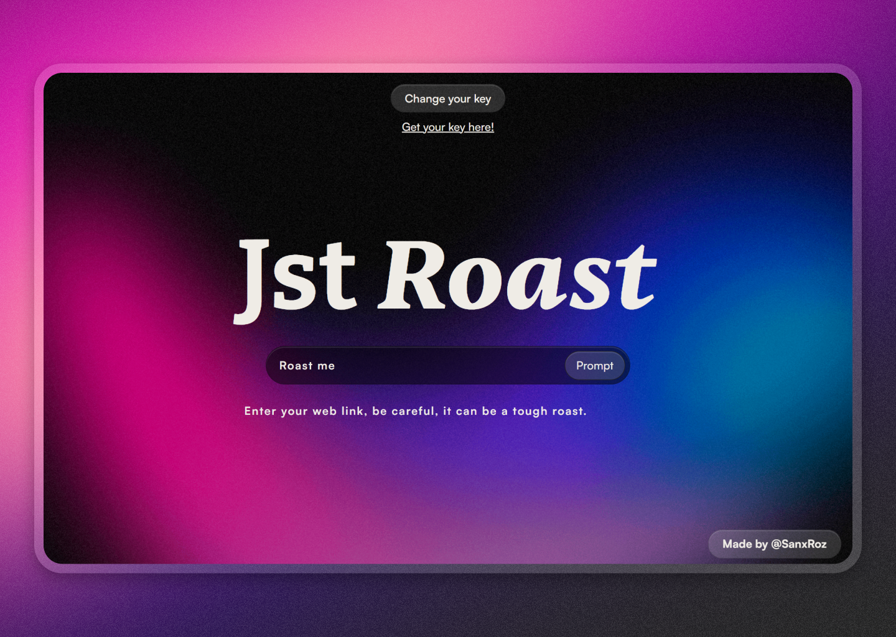

# Jst Roast

roast the copy of your website in seconds and get a recommendation, this app is based on Flask, HTML, Javascript and CSS

Take your prompts to the next level now!!

Check the [demo](https://jst-roast.vercel.app/)



## Contact

Feel free to reach me on [Twitter](https://twitter.com/SanxRoz)

I'd love to see what you build with this code - Looking forward to what you build!!!

## How it Works

Jst Roast me provides a simple, minimal and fully functional chat that you can use to build your own AI app powered by OpenAI.

Just plug and play, it has everything you need to start deploying.

To change the interface go to `api/templates/home.html`.

To modify your prompt or API go to `api/index.py`.

## Running Locally

**1. Clone Repo**

```bash
git clone https://github.com/SanxRoz/roast.git
```

**2. Install Dependencies**

```bash
pip install requirements.txt
```

**3. Provide OpenAI API Key**

Create a .env.local file in the root of the repo with your OpenAI API Key:

```bash
OPENAI_API_KEY=<YOUR_KEY>
```

**4. Run App**

```bash
cd api
python index.py
```

Your Flask application is now available at `http://localhost:3000`.
